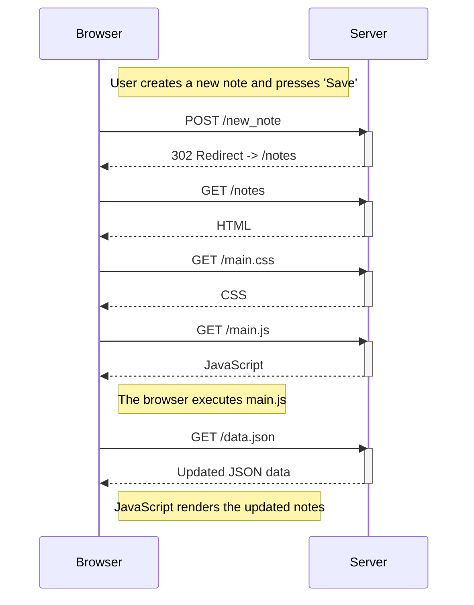

```mermaid
sequenceDiagram
    Note right of Browser: User creates a new note and presses 'Save'
    
    Browser->>Server: POST /new_note
    activate Server
    Server-->>Browser: 302 Redirect -> /notes
    deactivate Server

    Browser->>Server: GET /notes
    activate Server
    Server-->>Browser: HTML
    deactivate Server

    Browser->>Server: GET /main.css
    activate Server
    Server-->>Browser: CSS
    deactivate Server

    Browser->>Server: GET /main.js
    activate Server
    Server-->>Browser: JavaScript
    deactivate Server

    Note right of Browser: The browser executes main.js

    Browser->>Server: GET /data.json
    activate Server
    Server-->>Browser: Updated JSON data
    deactivate Server

    Note right of Browser: JavaScript renders the updated notes
```