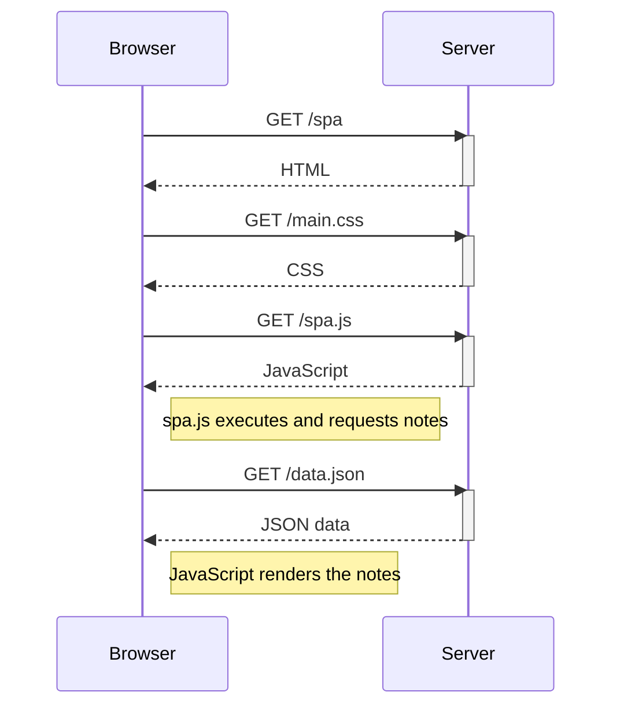

```mermaid
sequenceDiagram
    Browser->>Server: GET /spa
    activate Server
    Server-->>Browser: HTML
    deactivate Server

    Browser->>Server: GET /main.css
    activate Server
    Server-->>Browser: CSS
    deactivate Server

    Browser->>Server: GET /spa.js
    activate Server
    Server-->>Browser: JavaScript
    deactivate Server

    Note right of Browser: spa.js executes and requests notes

    Browser->>Server: GET /data.json
    activate Server
    Server-->>Browser: JSON data
    deactivate Server

    Note right of Browser: JavaScript renders the notes
```